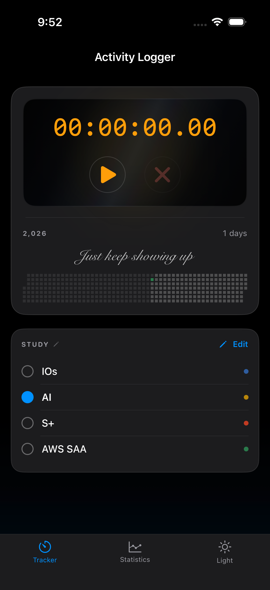
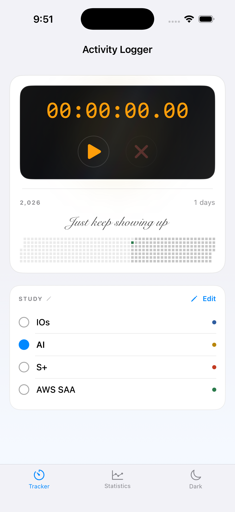
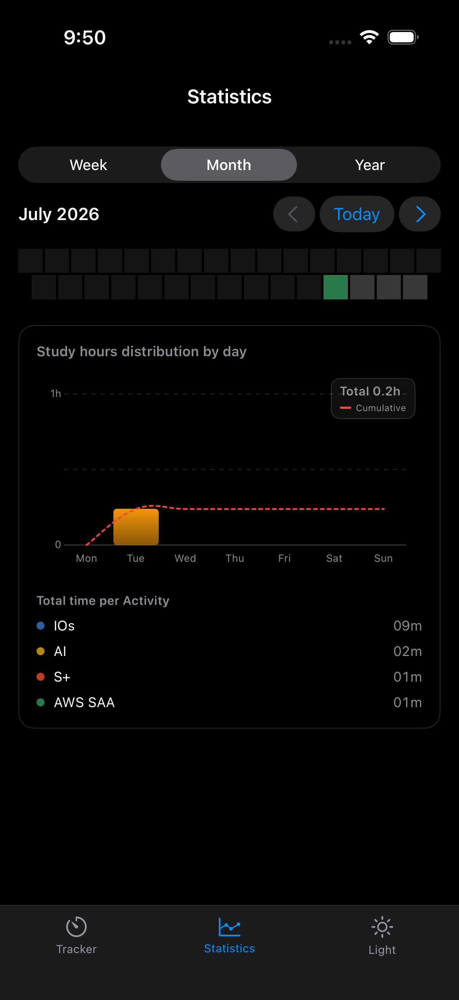
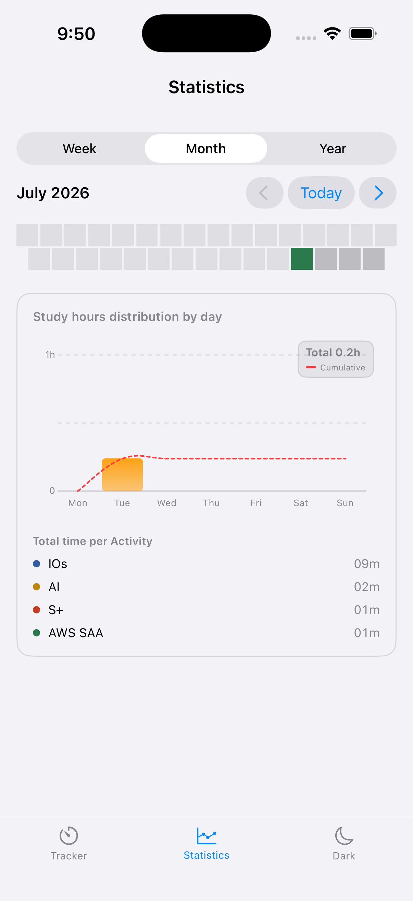
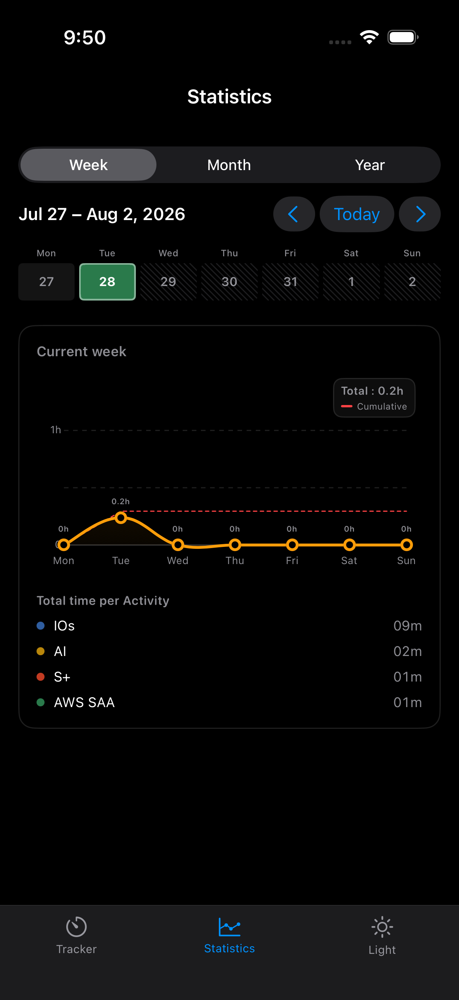
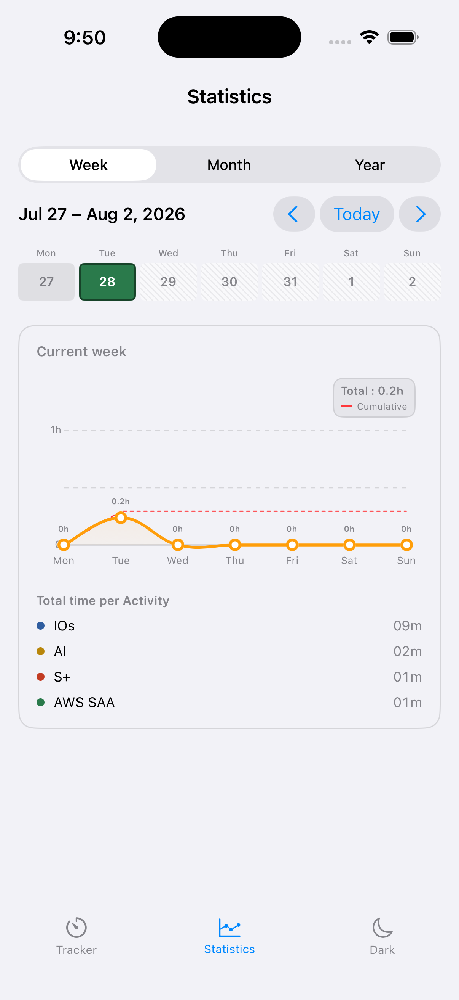
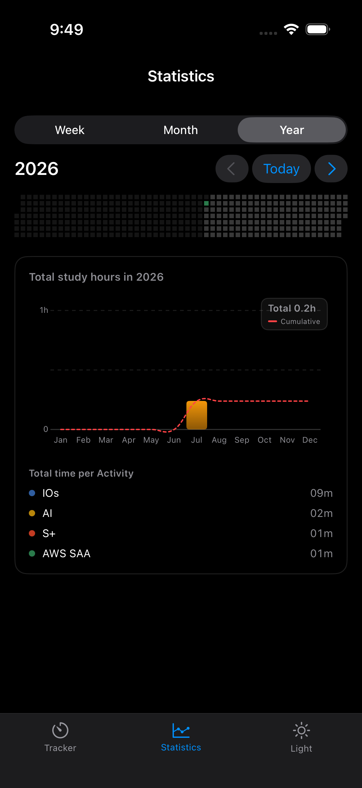
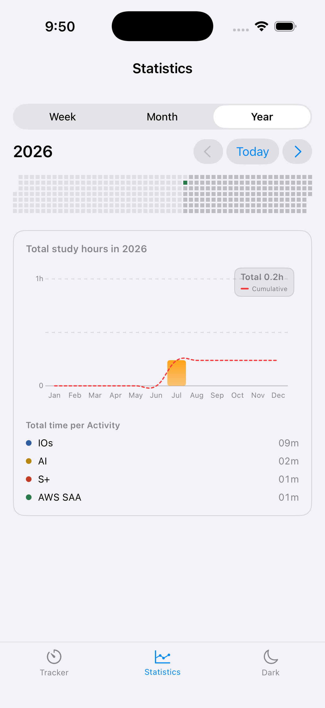

# Ios Activity Tracker

Native SwiftUI port of the Study Time Tracker. Data is stored on-device with **SwiftData** (replaces PostgreSQL). Timer and stats logic match the web/Django app: timestamp-based sessions and America/Chicago day allocation.

<p align="center">
   ...
  
</p>

<p align="center">
   ...
  
</p>

<p align="center">
   ...
  
</p>

<p align="center">
   ...
  
</p>

## Requirements

- Xcode 16+ (iOS 17.0 deployment target)
- macOS with Apple Silicon or Intel

## Open & run (Xcode)

1. Open the project:
   ```bash
   cd ios
   open StudyTime.xcodeproj
   ```
2. At the top of Xcode, click the device menu (next to **StudyTime**).
3. Choose a simulator, e.g. **iPhone 16 Pro**.
4. Press the **Play** button (or ⌘R).

The Simulator app should open and Study Time should appear.

### Run from Terminal (optional)

```bash
cd ios
xcodebuild -scheme StudyTime \
  -destination 'platform=iOS Simulator,name=iPhone 16 Pro,OS=18.3.1' \
  -derivedDataPath ./DerivedData build
xcrun simctl install booted ./DerivedData/Build/Products/Debug-iphonesimulator/StudyTime.app
xcrun simctl launch booted com.studytime.app
open -a Simulator
```

If you change `project.yml`, regenerate the Xcode project:

```bash
cd ios && xcodegen generate
```

## Features retained

- Study timer: Start / Pause / Resume / Stop
- Topic picker (locked while running), create, rename
- Lifetime Total + Today (Chicago timezone)
- Per-topic breakdown
- Monthly calendar with topic dots, minutes, ✓/✗ (>10 minutes)
- Week chart (last 7 days)
- Light / dark theme (UserDefaults)

## Storage mapping

| Web (PostgreSQL)       | iOS                        |
| ---------------------- | -------------------------- |
| `topics` table         | SwiftData `Topic`          |
| `study_sessions` table | SwiftData `StudySession`   |
| `localStorage.theme`   | `UserDefaults` key `theme` |

No backend or network required — fully offline.

## Project layout

```
ios/
  StudyTime.xcodeproj
  project.yml                 # xcodegen spec
  StudyTime/
    StudyTimeApp.swift
    Models/                   # Topic, StudySession
    Services/                 # Timer + statistics
    Utilities/                # Chicago time, formatting
    Views/                    # Timer, calendar, topics, chart
    Theme/
    Assets.xcassets/
```

## Stack

- Next.js frontend
- Django backend + ORM
- PostgreSQL
- Local Postgres via Docker Compose
- **iOS native app** (SwiftUI + SwiftData) in [`ios/`](ios/README.md)

Next proxies `/api/*` to Django so the browser stays same-origin.

## Local setup

```bash
make help   # list commands
make up     # start everything
make stop   # stop Next + Django only (keeps Postgres / data)
```

Open [http://localhost:3000](http://localhost:3000).

| Command                    | Description                                  |
| -------------------------- | -------------------------------------------- |
| `make help`                | List Make targets                            |
| `make up`                  | Full local startup                           |
| `make stop`                | Stop Next + Django (Postgres data untouched) |
| `make down`                | Stop Postgres container (keeps data volume)  |
| `make setup`               | Prepare without starting servers             |
| `make backend`             | Django only (`:8000`)                        |
| `make frontend`            | Next.js only (`:3000`)                       |
| `make migrate`             | Apply Django migrations                      |
| `make db-ui`               | Start pgAdmin (`:5050`)                      |
| `make db-backup`           | Dump DB to `db/backups/`                     |
| `make db-restore FILE=...` | Restore a SQL dump                           |
| `make db-wipe CONFIRM=YES` | Delete DB volume (only wipe command)         |

No other `make` target deletes database data.

## What it does

1. Track study time by topic/cert
2. Pause and resume the timer
3. Show total, today, and per-topic time
4. Show a monthly calendar of study days

## Docs

- [Data model & querying](docs/data-model.md)
- [Database / pgAdmin](db/README.md)
- [Backup & restore](db/BACKUP.md)

## API

| Method | Path                           | Purpose               |
| ------ | ------------------------------ | --------------------- |
| GET    | `/api/timer`                   | Current timer state   |
| POST   | `/api/timer/start`             | Start a session       |
| POST   | `/api/timer/pause`             | Pause                 |
| POST   | `/api/timer/resume`            | Resume                |
| POST   | `/api/timer/stop`              | Stop and save         |
| GET    | `/api/stats?year=2026&month=7` | Totals and month data |
| GET    | `/api/topics`                  | List topics           |
| POST   | `/api/topics`                  | Create topic          |
| PATCH  | `/api/topics/:id`              | Rename topic          |

## Production

```env
DATABASE_URL=postgresql://...
DJANGO_SECRET_KEY=...
DJANGO_DEBUG=false
DJANGO_ALLOWED_HOSTS=your.host
DJANGO_ORIGIN=https://your.api.host
```
