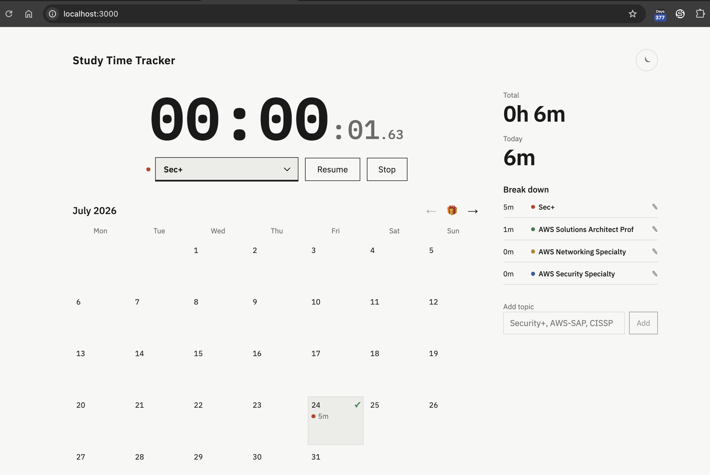
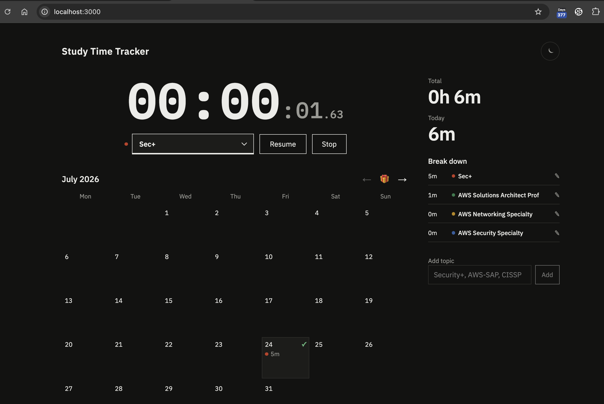

# Study Time Tracker

Hyper-minimal personal study time tracker. Single user.



## Stack

- Next.js frontend
- Django backend + ORM
- PostgreSQL
- Local Postgres via Docker Compose

Next proxies `/api/*` to Django so the browser stays same-origin.

## Local setup

```bash
make help   # list commands
make up     # start everything
make stop   # stop Next + Django only (keeps Postgres / data)
```

Open [http://localhost:3000](http://localhost:3000).

| Command         | Description                                      |
| --------------- | ------------------------------------------------ |
| `make help`     | List Make targets                                |
| `make up`       | Full local startup                               |
| `make stop`     | Stop Next + Django (Postgres data untouched)     |
| `make down`     | Stop Postgres container (keeps data volume)      |
| `make setup`    | Prepare without starting servers                 |
| `make backend`  | Django only (`:8000`)                            |
| `make frontend` | Next.js only (`:3000`)                           |
| `make migrate`  | Apply Django migrations                          |
| `make db-ui`    | Start pgAdmin (`:5050`)                          |
| `make db-wipe CONFIRM=YES` | Delete DB volume (only wipe command)  |

No other `make` target deletes database data.

## What it does

1. Track study time by topic/cert
2. Pause and resume the timer
3. Show total, today, and per-topic time
4. Show a monthly calendar of study days

## Docs

- [Data model & querying](docs/data-model.md)
- [Database / pgAdmin](db/README.md)

## API

| Method | Path                           | Purpose               |
| ------ | ------------------------------ | --------------------- |
| GET    | `/api/timer`                   | Current timer state   |
| POST   | `/api/timer/start`             | Start a session       |
| POST   | `/api/timer/pause`             | Pause                 |
| POST   | `/api/timer/resume`            | Resume                |
| POST   | `/api/timer/stop`              | Stop and save         |
| GET    | `/api/stats?year=2026&month=7` | Totals and month data |
| GET    | `/api/topics`                  | List topics           |
| POST   | `/api/topics`                  | Create topic          |
| PATCH  | `/api/topics/:id`              | Rename topic          |

## Production

```env
DATABASE_URL=postgresql://...
DJANGO_SECRET_KEY=...
DJANGO_DEBUG=false
DJANGO_ALLOWED_HOSTS=your.host
DJANGO_ORIGIN=https://your.api.host
```
